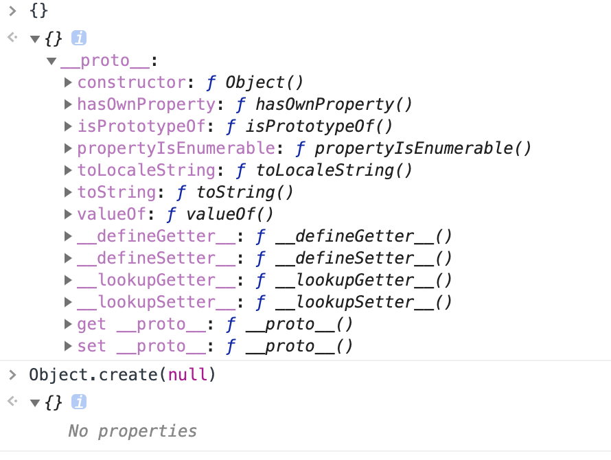

# 读源码中学习到的代码技巧

## 重写方法
```javascript
var a={
    title:"A",
    log:function (text){
      console.log("this.title:",this.title);
      console.log("this.text:",text);
    }
}
var func = a.log
a.log = function(){
    console.log("this is new func");
    func.apply(this,arguments)
}
a.log("A text")
```
### 生成一个纯净的对象
```javascript
Object.create(null)
```

